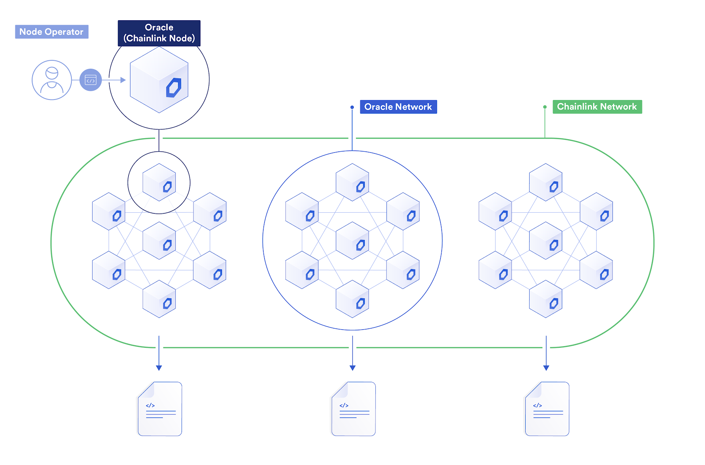
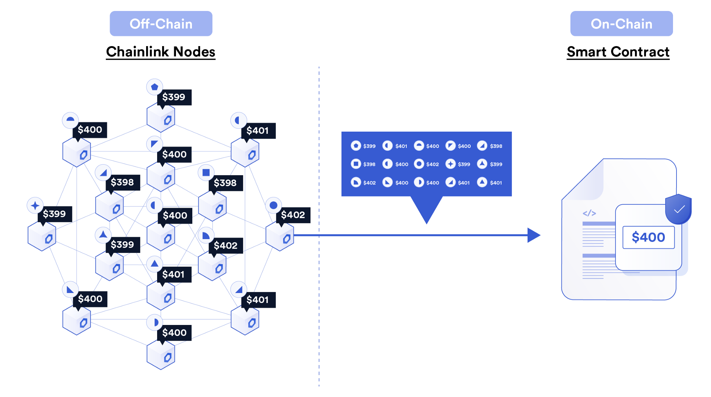

# Oracles on Store

## The Oracle Problem

Most blockchains, like Ethereum and Bitcoin, are sandboxed environments, they have no knowledge of, or access to, the external world. Ethereum’s EVM, for example, is not only unable to make external web API calls, but it cannot even access previous states of its own blockchain. These execution environments are limited by design.

Any data from the outside world that is required by these systems must be brought on-chain via transactions initiated by outside actors. Because much of what we would like to do with blockchains does in fact involve outside data, there is significant demand to do this.

This task of bringing external, real-world, data on-chain in a reliable, decentralized, and fidelity preserving way is the oracle problem.

## Existing Solutions

### Chainlink

Chainlink is the leading oracle solution. The system consists of nodes, organized into a network of networks, which send data on-chain via transactions to smart contracts which are responsible for specific data feeds.

A given data point, represented by a smart contract, may have multiple chainlink nodes feeding data into it. A given chainlink node may feed data to multiple different smart contracts. Thus, the network has a “network of networks” topology.

Chainlink fundamentally functions based on reputation and aggregation. Nodes in the network have a reputation which is tracked over time. Since all of their submissions (their transactions to various on-chain contracts) are cryptographically signed and part of the blockchain history, their entire history can be audited. The buyer of the data feeds offered by the chainlink network can specify reputation, SLA, and other parameters which must be met by supplying nodes. Therefore nodes are incentivized to provide high quality service.

Chainlink contracts which specify more than one node for their data source can aggregate the results from the supplying nodes in various ways. For a price feed for example, the contract may take price points from 20 nodes and then calculate the median price from these. That median value would be the final value used by the data buyer. Data feeds can be updated on regular intervals, or when the underlying data changes by some amount, or some other scheme.

Chainlink nodes are not limited to providing static data points. They can also complete computational work, generate randomness, etc.

Chainlink nodes can be required to stake some minimum amount on their performance for a data point contract. If they violate their SLA, they can be slashed.
